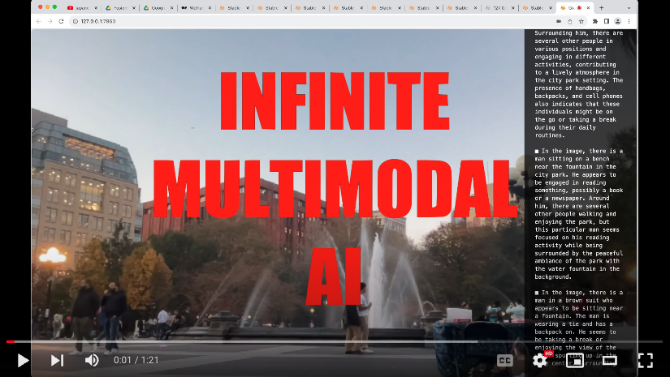

# Mirror

> Hackable AI Powered Mirror on your laptop.


Mirror is a web app that constantly watches the realtime video feed from the webcam and responds with comments.

1. **100% Local and Private:** Try all kinds of ideas. Don't worry, everything happens on your laptop with NO Internet connection.
2. **FREE:** Since the AI model is running 100% on your machine, you can keep it running forever and experiment with different things.
3. **Hackable:** Simply by changing the prompt (or tweaking the code), you can easily repurpose Mirror to do different things.

# How it works

Watch the video of Mirror in action:

[](https://www.youtube.com/watch?v=7Mx1W12Tvpw)

1. When you launch the app, the browser will ask you for webcam permission.
2. When you allow the webcam, it will start streaming the video to the AI ([Bakllava](https://huggingface.co/SkunkworksAI/BakLLaVA-1), running on [llama.cpp](https://github.com/ggerganov/llama.cpp)).
3. The AI will analyze the image and stream the response, which the frontend prints in realtime.

# Usage

When you launch the web UI, it will immediately start streaming responses from the AI based on the prompt: **"Describe a person in the image".**

**You can edit this field** to let Mirror start streaming whatever you want


Some example prompts you can try:

1. What is this object I am holding?
2. What is the person doing?
3. Describe some notable events in the image.
4. How many people are in this picture?
5. Let me know if you see anything weird.

# Install

## [RECOMMENDED] 1 Click Install

Try the 1 click install using Pinokio: https://pinokio.computer/item?uri=https://github.com/cocktailpeanut/mirror

> Make sure to use the latest version of Pinokio (0.1.49 and above)


>
> Mirror has a lot of moving parts, so if you don't use the 1 Click Installer, it may take a lot of work:
>
> 1. Orchestration of multiple backends (llama.cpp server and the gradio webui server)
> 2. Install pre-requisites, such as cmake, visual studio (windows), ffmpeg, etc.
>

If you want to install manually, go to the following section.

## Manual Install

> Note that everything mentioned in this entire section is essentially what the 1 Click Installer does, automatically, and works on Mac, Windows, and Linux. So if you get stuck trying to run Mirror manually, try the 1 click install.

### 1. Clone this repository

```
git clone https://github.com/cocktailpeanut/mirror
```

### 2. Clone llama.cpp

```
git clone https://github.com/ggerganov/llama.cpp
```

### 3. Download AI Model

Download the following bakllava model files to the `llama.cpp/models` folder

- https://huggingface.co/mys/ggml_bakllava-1/resolve/main/ggml-model-q4_k.gguf
- https://huggingface.co/mys/ggml_bakllava-1/resolve/main/mmproj-model-f16.gguf

### 4. Build llama.cpp


```
cd llama.cpp
mkdir build
cd build
cmake ..
cmake --build . --config Release
```

### 5. Install requirements

Create a venv and install rerquirements

```
python -m venv venv
source venv/bin/activate
pip install -r requirements.txt
```

### 6. Install prerequisites

Install FFMPEG: https://ffmpeg.org/download.html

### 7. Launch the llama.cpp server

First start the llama.cpp server:

#### Windows

```
cd llama.cpp\build\bin
Release\server.exe -m ..\..\ggml-model-q4_k.gguf --mmproj ..\..\mmproj-model-f16.gguf -ngl 1
```

#### Mac & Linux

```
cd llama.cpp\build\bin
./server -m ..\..\ggml-model-q4_k.gguf --mmproj ..\..\mmproj-model-f16.gguf -ngl 1
```

#### 8. Launch the web UI

First activate the environment:

```
source venv/bin/activate
```

Then run the app.py file

```
python app.py
```


# Credits

1. The backend code was inspired and adopted from [Realtime Bakllava](https://github.com/Fuzzy-Search/realtime-bakllava), which uses...
2. [Llama.cpp](https://github.com/ggerganov/llama.cpp) for the LLM Server.
3. [Bakllava](https://huggingface.co/SkunkworksAI/BakLLaVA-1) for the Multimodal AI model.
4. The Web UI was built with [gradio](https://www.gradio.app/).

